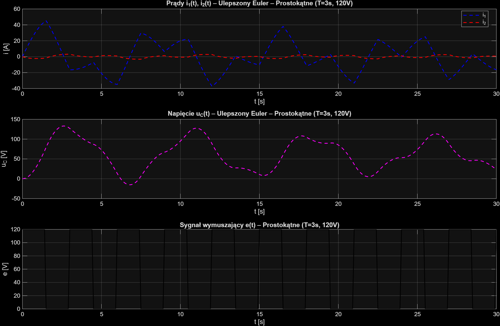
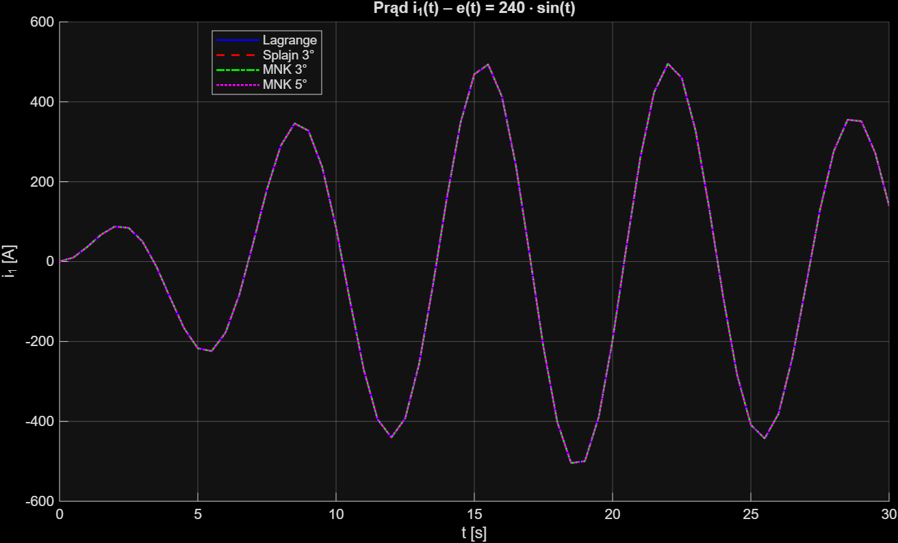
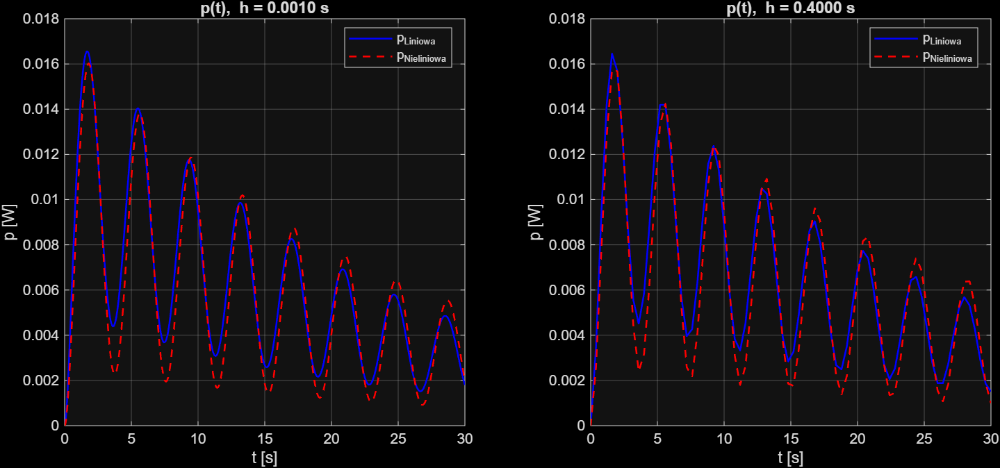

# Numerical Simulation Pipeline — Coupled RLC Circuit

MATLAB implementation of a 4-part numerical methods project simulating a coupled inductor RLC circuit under transient conditions. All solvers, interpolation methods, and root-finding algorithms implemented from scratch — no built-in MATLAB solvers used.

## Circuit model

The circuit is described by a 3-variable state-space ODE system derived from Kirchhoff's laws:

$$\frac{di_1}{dt} = \frac{-R_1/M \cdot i_1 + R_2/L_2 \cdot i_2 - \frac{1}{M} u_C + \frac{1}{M} e}{\frac{L_1}{M} - \frac{M}{L_2}}$$

$$\frac{di_2}{dt} = \frac{-R_1/L_1 \cdot i_1 + R_2/M \cdot i_2 - \frac{1}{L_1} u_C + \frac{1}{L_1} e}{\frac{M}{L_1} - \frac{L_2}{M}}$$

$$\frac{du_C}{dt} = \frac{i_1}{C}$$

State variables: $i_1$ (primary current), $i_2$ (secondary current), $u_C$ (capacitor voltage). Initial conditions: $i_1 = 0\ \text{A},\ i_2 = 0\ \text{A},\ u_C = 0\ \text{V}$.

Circuit parameters: $R_1,\ R_2,\ L_1 = 3\ \text{H},\ L_2 = 5\ \text{H},\ M = 0.8\ \text{H},\ C = 0.5\ \text{F}$.

## Repository structure
time-series-numerical-methods/

├── src/

│   ├── czesc1.m   # ODE solvers — Euler & improved Euler, 4 forcing signals

│   ├── czesc2.m   # Nonlinear M(u1) via interpolation & approximation

│   ├── czesc3.m   # Numerical integration of instantaneous power

│   └── czesc4.m   # Root-finding: bisection, secant, quasi-Newton

├── docs/

│   └── Raport_Bartosz_Kalinowski.pdf   # Full simulation report with results

├── .gitignore

└── README.md

## What each part does

### Part 1 — ODE Solvers

Simulates circuit response over $t \in [0, 30]$ s for four forcing signals using two methods:

- **Euler method:** $y_{i+1} = y_i + h \cdot f(x_i, y_i)$
- **Improved Euler method:** $y_n = y_{n-1} + h \cdot f\!\left(x_{n-1} + \frac{h}{2},\ y_{n-1} + \frac{h}{2} f(x_{n-1}, y_{n-1})\right)$

Four forcing signals tested, each with a separately tuned step $h$ to expose the accuracy gap between methods:

| Signal | Step $h$ | Observation |
|---|---|---|
| $E = 120\ \text{V}$ (square, $T = 3\ \text{s}$) | 0.1 | Euler overshoots current peaks |
| $e(t) = 240\sin(t)$ | 0.5 | Euler diverges; improved Euler stays stable |
| $e(t) = 210\sin(2\pi \cdot 5t)$ | 0.1 | Euler collapses to $10^{-12}$; improved Euler shows aliasing |
| $e(t) = 120\sin(2\pi \cdot 50t)$ | 0.009 | Improved Euler maintains sinusoidal shape |

**Key finding:** Improved Euler consistently outperforms standard Euler — higher accuracy at the same step size, enabling larger steps overall.



---

### Part 2 — Nonlinear mutual inductance $M_n(u_1)$

Replaces constant $M = 0.8\ \text{H}$ with a voltage-dependent function estimated from 10 measurement points. Four methods implemented and compared:

- **Lagrange polynomial interpolation**
- **Cubic spline interpolation** (B-spline basis $\Phi_i(x)$, equidistant nodes)
- **Least-squares polynomial approximation** — degree 3
- **Least-squares polynomial approximation** — degree 5 (with argument scaling to avoid ill-conditioned Vandermonde matrix)

Measurement data clamped to $u_1 \in [20, 300]\ \text{V}$, $M \in [0.1, 1.0]\ \text{H}$ to ensure solver stability. Without clamping, only the cubic spline remained stable (its basis functions return 0 outside the defined node range).

**Key finding:** All four methods converge to identical waveforms after clamping — the nonlinear model produces physically consistent results matching Kirchhoff's laws.



---

### Part 3 — Numerical integration of energy

Total heat dissipated on both resistors over $[0, 30]$ s:

$$W = \int_0^{30} \left( R_1 i_1^2(t) + R_2 i_2^2(t) \right) dt, \qquad P = \frac{W}{T}$$

Two composite integration methods, two step sizes, both linear and nonlinear $M$:

- **Composite rectangle rule** (midpoint)
- **Composite Simpson's rule** (parabolas): $I(f) \approx \frac{h}{3}\left(f(x_0) + 2\sum_{k=2,4,\ldots} f(x_k) + 4\sum_{k=1,3,\ldots} f(x_k) + f(x_m)\right)$

| Step | Result |
|---|---|
| $h = 0.001$ | Both methods identical — step dominates accuracy |
| $h = 0.4$ | Simpson's more accurate than rectangle; both diverge from true values |

**Key finding:** Step size is the critical parameter — method choice matters only when $h$ is large enough to expose approximation error.



---

### Part 4 — Root-finding: frequency for target power

Find $f$ such that average power $P(f) = 406\ \text{W}$, i.e. solve $F(f) = P(f) - 406 = 0$.

Three methods implemented, derivative approximated via finite difference $\Delta f = 10^{-4}$:

| Method | $f$ [Hz] | $F(f)$ | Iterations | Power evaluations |
|---|---|---|---|---|
| Bisection | 0.2709 | < 0.0001 | 10 | 12 |
| Secant | 0.2710 | < 0.0001 | 8 | 9 |
| Quasi-Newton | 0.2710 | < 0.0001 | 7 | 14 |

**Key finding:** All three methods converge to $f = 0.2710\ \text{Hz}$, consistent with the circuit's low resonant frequency driven by large $C = 0.5\ \text{F}$ and inductances $L_1 = 3\ \text{H}$, $L_2 = 5\ \text{H}$.

## How to run

Open MATLAB (tested on R2023a+) and run each part independently:

```matlab
run('src/czesc1.m')
run('src/czesc2.m')
run('src/czesc3.m')
run('src/czesc4.m')
```

No external toolboxes required.

## Full report

Detailed simulation results, plots, and analysis available in [`docs/Raport_Bartosz_Kalinowski.pdf`](docs/Raport_Bartosz_Kalinowski.pdf).

## Skills demonstrated

Numerical stability analysis, ODE solver design, polynomial interpolation and approximation, composite numerical quadrature, iterative root-finding, step-size sensitivity benchmarking.